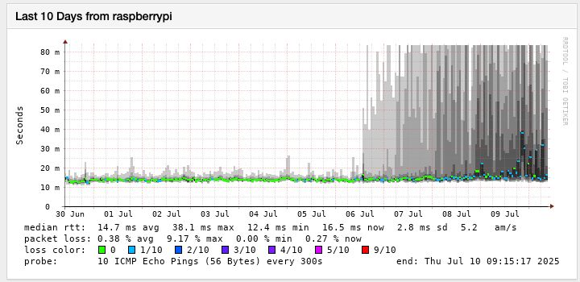

# 🥧 Smoking Pi

Continuous network monitoring for your home or lab, in a box. Smoking Pi wraps [SmokePing](https://oss.oetiker.ch/smokeping/) in Docker Compose and grows with you: from a single container reading a YAML file, to a full stack with a web admin, Grafana dashboards, a time-series database, alerting that leads with a verdict, and an MCP server so an AI assistant can answer *"how's my internet?"* from months of recorded history instead of a live `ping`. Built for a Raspberry Pi (ARM64) and runs anywhere Docker does.

[](https://github.com/estcarisimo/smoking-pi/actions/workflows/ci.yml)
[](https://www.python.org/downloads/)
[](https://docs.docker.com/compose/)
[](https://www.raspberrypi.com/)
[](https://opensource.org/licenses/MIT)

## ✨ Features

- 📡 **Continuous measurement**: ICMP latency and loss to every target on a 300 s cycle, plus DNS resolution timing and IPv6 — recorded for months, not sampled once
- 🎚️ **Three editions, one setup script**: Basic (YAML), Standard (web admin + PostgreSQL + REST API), Pro (everything + Grafana + InfluxDB/ClickHouse)
- 📊 **Grafana dashboards**: per-target detail with every individual ping, side-by-side comparisons, percentiles, and CPE microcut detection sampled every 10 s
- 🚨 **Alerts that say what they mean**: every alert leads with a verdict — *is it me or the internet?* — carries the chart, and can be muted by asking in chat
- 🤖 **MCP server + agent skill**: ask an AI assistant about last night's outage; answers come with deep links into the exact Grafana view
- 🖼️ **Charts you can forward**: `get_chart` renders a PNG of any target — median with the spread of individual pings — for someone with no login here
- 🩺 **Instrumentation doctor**: static and live checks that the dashboards, exporters, containers and DNS actually agree with each other
- 🌐 **Remote access built in**: temporary Cloudflare tunnels with no account, or permanent ones with yours
- 🔐 **Secure defaults**: generated passwords, bearer-token APIs, loopback-only bindings, snapshots off, error responses that never echo internals
- 🍿 **Netflix CDN monitoring**: discovers the Open Connect Appliances serving your network and tracks them

## 🚀 Quick Start

### Installation

You need Docker with the Compose plugin (`docker compose version`). Clone, pick an edition, run its setup:

```bash
# Clone
git clone https://github.com/estcarisimo/smoking-pi.git
cd smoking-pi

# Pro edition (full stack, InfluxDB)
cd editions/pro
./setup.sh
```

`setup.sh` generates a `.env` with strong random passwords, detects your timezone, starts the containers, waits for them to be healthy, and prints the URLs and credentials.

```bash
# Or start smaller
cd editions/basic    && ./setup.sh                        # SmokePing + YAML config
cd editions/standard && ./setup.sh                        # + web admin, PostgreSQL, REST API
cd editions/pro      && ./setup.sh --database clickhouse  # Pro with ClickHouse instead of InfluxDB
```

> **Note:** nothing is published to a package registry — install from a clone, as shown above. `.env` files hold real secrets and are gitignored; never commit them.

### System Requirements

- Docker Engine with the Compose v2 plugin
- A Raspberry Pi 4/5 (ARM64) or any x86-64 Linux host. Pro with Grafana + InfluxDB is comfortable on a Pi 5 with 4 GB
- Outbound ICMP (the whole point) and, for the optional integrations, outbound HTTPS

### Choose Your Edition

| Edition | Perfect for | What you get | Setup time |
|---|---|---|---|
| 🟢 **[Basic](editions/basic/)** | Home users, one box | LinuxServer.io SmokePing, targets in a YAML file, classic web UI, RRD storage | 2 min |
| 🟡 **[Standard](editions/standard/)** | Small teams | + web admin with login, PostgreSQL as the source of truth, REST API, bulk target management | 5 min |
| 🔴 **[Pro](editions/pro/)** | Everything | + Grafana dashboards, InfluxDB or ClickHouse, IPv6 + DNS probes, alerting, MCP server, AI reports, doctor | 10 min |

Upgrade path is `Basic → Standard → Pro`; `shared/scripts/migrate-to-edition.sh` backs up and migrates your data between editions.

## 📖 Usage

### Basic Usage

```bash
# Where is everything, and what are the passwords?
./show-passwords.sh                      # from any edition directory

# Container lifecycle
../../shared/scripts/manage-containers.sh --action status --verbose
../../shared/scripts/manage-containers.sh --action logs --service grafana
../../shared/scripts/manage-containers.sh --action restart --edition pro

# Plain Compose works too, from the edition directory
docker compose ps
docker compose logs -f smokeping
```

### Managing Targets

- **Basic**: edit `config/targets.yaml` and restart — it is validated on startup
- **Standard / Pro**: the web admin at `http://<host>:8080` (targets, sources, countries, bulk operations), or the config-manager REST API on `127.0.0.1:5000` with a bearer token. PostgreSQL is the source of truth; the YAML files are import/export only

```bash
# REST API, from the host (token is CONFIG_API_TOKEN in .env)
curl -H "Authorization: Bearer $CONFIG_API_TOKEN" http://127.0.0.1:5000/targets
curl -X POST -H "Authorization: Bearer $CONFIG_API_TOKEN" http://127.0.0.1:5000/generate
```

### Ask Your Network How It's Doing

Pro ships an MCP server and a ready-made agent skill, so *"how was the week?"* is answered from recorded history rather than a live probe:

```bash
# Start the MCP server (opt-in profile) and register it with a client
COMPOSE_PROFILES=influxdb,mcp docker compose up -d mcp-server
claude mcp add --transport http smokeping http://127.0.0.1:8090/mcp

# Install the OpenClaw skill so a Telegram chat can ask; re-run after any change
./shared/scripts/install-openclaw-skill.sh --reload
./shared/scripts/install-openclaw-skill.sh --check     # non-zero if the copy is stale
```

Tools: `get_latency_stats`, `get_loss_events`, `get_microcut_stats`, `system_status`, `get_chart` (a PNG, on request only), `mute_alerts` / `ack_incident`, and target management. Every answer carries deep links into the Grafana view for that target and window. See [docs/mcp-server.md](docs/mcp-server.md) and [docs/openclaw-integration.md](docs/openclaw-integration.md).

### Alerts

```bash
# Opt in, log-only until you point it somewhere
COMPOSE_PROFILES=influxdb,alerts docker compose up -d alerter
# Deliver to a chat via OpenClaw, or to any webhook -- see docs/alerting.md
```

Rules: target down, high loss, CPE microcut bursts, exporter stale. Each alert leads with a verdict (*🌐 not you — 12 of 16 destinations affected but your local link is clean*), attaches the chart, and links home and from-anywhere. A daily digest makes a quiet day distinguishable from a dead monitor. Muting is done by asking the assistant, capped at 24 h, and read back to you. See [docs/alerting.md](docs/alerting.md).

### Remote Access

```bash
# Temporary URLs, no account needed (*.trycloudflare.com)
./shared/scripts/create-tunnel.sh create
./shared/scripts/show-tunnel-urls.sh
./shared/scripts/create-tunnel.sh stop

# Permanent tunnel with your own Cloudflare account and domain
cd shared/cloudflare-tunnel && cp .env.template .env   # add CLOUDFLARE_TUNNEL_TOKEN
docker compose up -d
```

Anything you put a tunnel in front of should have authentication in front of the tunnel — see [SECURITY.md](SECURITY.md). Guides: [quick tunnels](shared/docs/quick-tunnels.md), [permanent tunnels](shared/docs/cloudflare-tunnel-setup.md).

### 🐳 Docker Usage

Everything is Compose. Optional services are behind profiles so the default stack stays small:

| Profile | Adds | Needs |
|---|---|---|
| `influxdb` *(default via setup.sh)* | InfluxDB 2.x + the RRD→Influx exporter | — |
| `clickhouse` | ClickHouse + its exporter and dashboards (`-f docker-compose.clickhouse.yml`) | see [docs/clickhouse.md](docs/clickhouse.md) |
| `alerts` | The alerting engine and daily digest | `NOTIFY_MODE` + delivery settings |
| `mcp` | MCP server on `127.0.0.1:8090` | `MCP_API_TOKEN` |
| `ai` | AI health reports | `ANTHROPIC_API_KEY` |

```bash
# Pro with alerts and the MCP server
COMPOSE_PROFILES=influxdb,alerts,mcp docker compose up -d

# Pro on ClickHouse
COMPOSE_PROFILES=clickhouse docker compose -f docker-compose.yml -f docker-compose.clickhouse.yml up -d

# Rebuild one service after pulling changes
docker compose build web-admin && docker compose up -d web-admin
```

## 🔧 Configuration

### Environment Variables

`setup.sh` writes `editions/<edition>/.env` from `.env.template`; every key in the template ships empty and is documented inline. The ones you are most likely to touch:

| Variable | Purpose |
|---|---|
| `TZ` | Timezone for the stack and for chart axes |
| `CONFIG_API_TOKEN`, `MCP_API_TOKEN` | Bearer tokens for the config-manager API and the MCP server |
| `WEB_ADMIN_USERNAME`, `WEB_ADMIN_PASSWORD_HASH` | Web admin login |
| `PUBLIC_BASE_HOST`, `TUNNEL_BASE_HOST` | Where readers reach Grafana/web-admin; enables deep links (at home / from anywhere) |
| `NOTIFY_MODE`, `OPENCLAW_*`, `ALERT_WEBHOOK_URL` | Alert delivery |
| `ALERT_CHARTS`, `CHART_THEME`, `CHART_HOURS` | Charts attached to alerts |
| `IPV6_MODE` | `auto` (gate on real global IPv6), `force`, or `off` |
| `ANTHROPIC_API_KEY` | AI reports and the web-admin assistant |

### Configuration Files

- `editions/<edition>/config-manager/config/{targets,probes,sources}.yaml` — targets, probe definitions, and the top-sites sources (Tranco, CrUX, Cloudflare Radar) used to pick targets by country
- Generated SmokePing `Targets` / `Probes` land in `config-manager/output/` and are mounted into the SmokePing container; do not edit them by hand
- Grafana dashboards are provisioned from `shared/modules/grafana/provisioning/` — separate sets for InfluxDB and ClickHouse

## 🏗️ Architecture

Each edition is a Compose file that assembles services from `shared/modules/`; containers never import across each other, and the few pieces two containers share live in `shared/modules/common/`.

```text
smoking-pi/
├── editions/
│   ├── basic/                 # SmokePing + YAML
│   ├── standard/              # + config-manager, web-admin, PostgreSQL
│   └── pro/                   # + Grafana, InfluxDB/ClickHouse, alerter, MCP, AI, doctor
├── shared/
│   ├── modules/
│   │   ├── smokeping/         # LinuxServer.io SmokePing image, exporter hooks
│   │   ├── config-manager/    # Flask API: YAML ↔ PostgreSQL ↔ generated SmokePing config
│   │   ├── web-admin/         # Flask UI: targets, sources, countries, AI assistant
│   │   ├── grafana/           # Custom image with provisioned dashboards
│   │   ├── smokeping-exporters/  # RRD → InfluxDB / ClickHouse, CPE microcut detector
│   │   ├── alerter/           # Rules, verdict, charts, digest, delivery
│   │   ├── mcp-server/        # MCP tools over the config API and InfluxDB
│   │   ├── ai-insights/       # Periodic AI health reports
│   │   ├── doctor/            # Static + live instrumentation checks
│   │   └── common/            # Flux helpers, chart renderer, deep links, mutes, OpenClaw client
│   ├── scripts/               # setup helpers, container management, tunnels, skill install
│   ├── docs/                  # tunnels, maintenance
│   └── cloudflare-tunnel/     # permanent tunnel Compose
├── docs/                      # alerting, MCP, OpenClaw, doctor, ClickHouse, IPv6, upgrades
└── examples/openclaw/         # the agent skill
```

**Data flow:** YAML → config-manager bootstraps PostgreSQL → generates SmokePing `Targets`/`Probes` → SmokePing writes RRDs → exporters push to InfluxDB/ClickHouse → Grafana, the alerter and the MCP server read the time series.

## 🧪 Development

### Setup Development Environment

```bash
git clone https://github.com/estcarisimo/smoking-pi.git
cd smoking-pi

# Each module is its own package; use uv or a venv per module
cd shared/modules/config-manager
uv sync            # or: python -m venv .venv && pip install -e ".[dev]"
```

### Running Tests

Every module with a `tests/` directory is discovered by CI. Tests mock the network, the database and Docker; none needs a running stack.

```bash
cd shared/modules/alerter     && pytest tests/ -q
cd shared/modules/mcp-server  && pytest tests/ -q
cd shared/modules/web-admin   && pytest tests/ -q
cd shared/modules/config-manager && pytest tests/ -q
```

### Code Quality

```bash
# Lint (CI enforces the critical rules; modules configure ruff fully)
ruff check shared/modules editions

# The doctor: dashboards, exporters and compose defaults agree with each other
PYTHONPATH=shared/modules/doctor python -m doctor --repo-root . --verbose
# ...and against the running stack, from an edition directory
PYTHONPATH=../../shared/modules/doctor python -m doctor --repo-root ../.. --live
```

CI runs ruff, shell syntax, Compose config for every edition, Docker builds, the doctor, module tests on Python 3.14, and CodeQL. Every change goes branch → PR → green CI → merge → deploy → smoke test; the [CHANGELOG](CHANGELOG.md) records the why, not just the what.

## 📊 Example Output

A SmokePing graph of ten days on a home line, as served by the Basic edition — the "smoke" is the spread of the individual pings around the median:

<div align="center">
  
</div>

An alert as it arrives in chat (Pro, `alerts` profile):

```text
🟡 warning — UBA
🌐 Not you — 12 of 16 destinations affected but your local link is clean
UBA: mean loss 22.5% over 15m
graph · per-ping · peers · edit · 🌐 anywhere
[chart attached]
```

And the answer to *"send me a picture of the gateway for the last week"* is a PNG: median latency with the spread of individual pings shaded, loss underneath on a fixed 0–100 axis, local time, and a footer naming the source — delivered into the chat so it can be forwarded to a friend or the ISP.

## 🤝 Contributing

Contributions are welcome. Please see the [Contributing Guidelines](CONTRIBUTING.md)
for setup instructions, the development workflow, and what to include in a bug report.
The workflow this repository follows for every change:

1. Fork the repository
2. Create a feature branch (`git checkout -b feat/amazing-feature`)
3. Add or update tests next to the module you changed
4. Commit with a message that says why (`git commit -m 'feat: add amazing feature'`)
5. Push to the branch and open a Pull Request — CI must be green

### Project documentation

| Document | Contents |
| --- | --- |
| [CONTRIBUTING.md](CONTRIBUTING.md) | Development setup, workflow, PR expectations, the load-bearing oddities |
| [CHANGELOG.md](CHANGELOG.md) | Release history, with the reasoning behind each change |
| [AGENTS.md](AGENTS.md) | Guidance for AI coding agents working in this repo |
| [CODE_OF_CONDUCT.md](CODE_OF_CONDUCT.md) | Community standards |
| [SECURITY.md](SECURITY.md) | Vulnerability reporting, scope, and what this stack assumes about your network |
| [docs/alerting.md](docs/alerting.md) | Rules, the verdict, charts, digest, muting, delivery, flap damping |
| [docs/mcp-server.md](docs/mcp-server.md) | MCP tools, deep links, on-request charts |
| [docs/openclaw-integration.md](docs/openclaw-integration.md) | Registering the MCP server and installing the skill for a chat assistant |
| [docs/doctor.md](docs/doctor.md) | The instrumentation doctor: static and live checks |
| [docs/clickhouse.md](docs/clickhouse.md) | Running Pro on ClickHouse, and its traps |
| [docs/ipv6-gating.md](docs/ipv6-gating.md) | Why IPv6 targets disappear when there is no global IPv6 |
| [docs/ai-insights.md](docs/ai-insights.md) | AI health reports |
| [docs/upgrades.md](docs/upgrades.md) | Upgrading between versions |
| [shared/docs/maintenance.md](shared/docs/maintenance.md) | Stuck containers, volumes, cleanup |
| [editions/basic](editions/basic/README.md) · [standard](editions/standard/README.md) · [pro](editions/pro/README.md) | Per-edition guides |

### Getting Help

- 📖 **Documentation**: the per-edition READMEs and `docs/`
- 🐛 **Issues**: GitHub Issues for bug reports
- 💬 **Discussions**: GitHub Discussions for questions
- 🔒 **Security**: privately, as described in [SECURITY.md](SECURITY.md) — never in a public issue

## 📄 License

This project is licensed under the MIT License — see the [LICENSE](LICENSE) file for details.

## 🔗 Related Resources

- [SmokePing](https://oss.oetiker.ch/smokeping/) — the measurement engine, by Tobi Oetiker
- [LinuxServer.io SmokePing image](https://docs.linuxserver.io/images/docker-smokeping/) — the container the Basic edition and the Pro probes run on
- [Netflix Open Connect](https://openconnect.netflix.com/) — the CDN whose appliances the `netflix_oca` category tracks
- [Netflix OCA Locator](https://github.com/estcarisimo/Netflix-OCA-Servers-Locator) — the sibling project that discovers those appliances
- [Model Context Protocol](https://modelcontextprotocol.io/) — what the assistant integration speaks
- [Grafana](https://grafana.com/) · [InfluxDB](https://www.influxdata.com/) · [ClickHouse](https://clickhouse.com/)

## 🙏 Acknowledgements

- **Tobi Oetiker** for SmokePing and RRDtool, which still draw the best latency graph there is
- **LinuxServer.io** for a SmokePing image that is maintained
- **Tranco, the Chrome UX Report and Cloudflare Radar** for the top-sites lists that seed per-country targets
- **The Grafana, InfluxDB and ClickHouse communities** for the storage and the pictures

---

<div align="center">
  <b>Start with Basic, grow to Pro.</b><br>
  Continuous, honest network monitoring for everyone.
</div>
