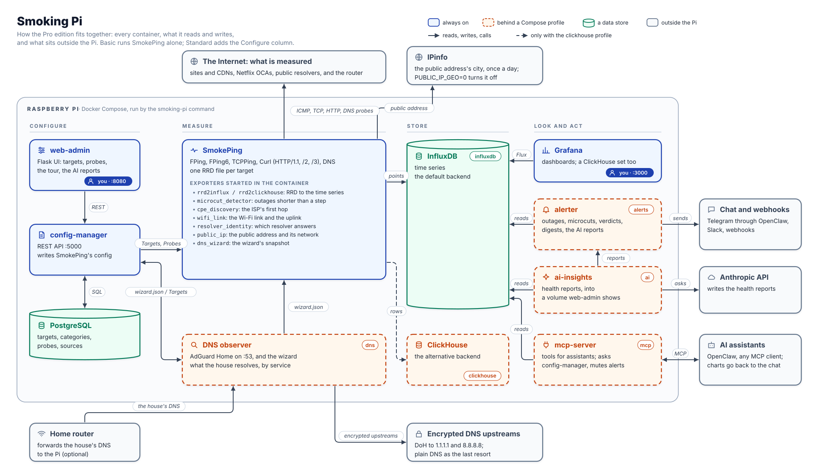

# Architecture

How the Pro edition fits together: every container, what it reads and
writes, and what sits outside the Pi. Basic and Standard are subsets. Basic
runs SmokePing alone, and Standard adds web-admin, config-manager and
PostgreSQL.



Solid boxes are always on. Dashed boxes run only when their
[Compose profile](https://docs.docker.com/compose/how-tos/profiles/) is on,
named in brackets. InfluxDB is itself the `influxdb` profile: it is the
default time-series backend, and ClickHouse is the alternative.

## The paths through it

**Configuration.** You edit targets and probes in web-admin, which calls
config-manager's REST API. config-manager keeps them in PostgreSQL and writes
SmokePing's `Targets` and `Probes` files, then asks SmokePing to reload.

**Measurement.** SmokePing probes the targets (ICMP, TCP, HTTP/1.1, /2 and
/3, DNS) and writes one RRD file per target. Scripts started inside the
SmokePing container turn those RRDs into time series and add their own
measurements: microcuts shorter than a SmokePing step, the ISP's first hop,
the Wi-Fi link, which public resolver answers, and the DNS wizard's
snapshot.

**Looking and acting.** Grafana, the alerter, ai-insights and the MCP server
all read InfluxDB. With the `clickhouse` profile, Grafana reads ClickHouse
through its own set of dashboards. The alerter sends alerts and digests to
Telegram (through the OpenClaw gateway), Slack or webhooks. ai-insights asks
the Anthropic API for written health reports and writes them to a shared
volume: web-admin shows them and the alerter delivers them. The MCP server
answers AI assistants such as OpenClaw, and posts charts back into the chat
through the same gateway.

Three lines are left out of the drawing to keep it readable. The MCP server
asks config-manager for targets and probes. The MCP server writes alert
mutes that the alerter reads, and it reads the alerter's state. web-admin
reads the reports volume.

**The house's DNS (optional).** When the router forwards the house's DNS to
the Pi, the [DNS observer](dns-observer.md) resolves it through encrypted
upstreams and its wizard summarises which services the house uses. The
wizard's `wizard.json` feeds an exporter in the SmokePing container and
`smoking-pi dns adopt` in config-manager. In the other direction, the
observer reads SmokePing's generated `Targets`, so the Pi's own lookups of
what it measures are not counted as the house's.

**The host.** The `smoking-pi` command runs all of it with Docker Compose;
a `.deb` install adds a systemd unit that brings it back after a reboot. See [Command vs API scope](cli-scope.md).

## Editing the drawing

The drawing comes from one spec,
[`tools/architecture/architecture.py`](https://github.com/estcarisimo/smoking-pi/blob/main/tools/architecture/architecture.py),
which writes both this SVG and
[`architecture.excalidraw`](https://github.com/estcarisimo/smoking-pi/blob/main/docs/architecture.excalidraw).
To sketch a change by hand, open the `.excalidraw` file at
[excalidraw.com](https://excalidraw.com) (menu, then *Open*). To change the
diagram for good, edit the spec and run:

```bash
python3 tools/architecture/architecture.py
```

Its tests fail when a service in any edition's Compose file is not drawn,
when a box's profile disagrees with Compose, when an exporter the SmokePing
container starts is not listed, or when the committed drawings are older
than the spec. A new container cannot ship without appearing here.
