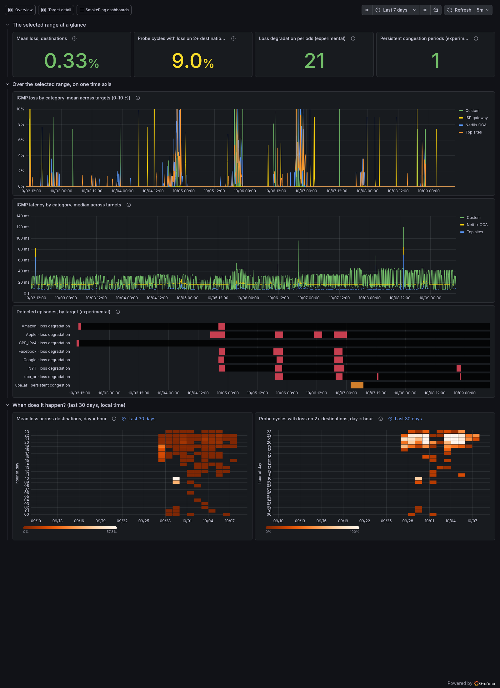

# Connectivity and quality

The **Connectivity & Quality** dashboard answers "is the connection's quality
changing, and when?". The Overview tells you how things are right now. This
dashboard puts the selected range (seven days by default) on one time axis,
so a burst of loss, a step in latency and a detected episode line up
vertically. Below that, it shows the last 30 days by hour of day, where a
daily pattern stands out.

Open it from the dashboard list (*SmokePing dashboards*) or from the
Overview's *Where to look next* list. It is part of the InfluxDB dashboard
set: Pro with ClickHouse does not have it.

## At a glance

| Tile | What it counts |
| --- | --- |
| Mean loss, destinations | Share of pings lost across every destination over the range |
| Probe cycles with loss on 2+ destinations | Share of 5-minute cycles in which at least two destinations lost packets at once |
| Loss degradation periods | Periods the inference module found, when it is on |
| Persistent congestion periods | Periods Jitterbug labeled congested, when it is on |

"Destinations" leaves out two kinds of target. The **ISP gateway**
rate-limits ICMP and has a loss floor of its own. The **DNS wizard's**
targets are left out because many CDNs drop ICMP. Both are ICMP targets
like the rest, but counting them would make the numbers describe the probes
rather than the connection.

The second tile is usually the more telling one. One destination losing
packets is that destination's problem. Two or more losing in the same cycle
point at something they share: the house, the line or the ISP.

## On one time axis

- **ICMP loss by category (0–10 %).** This is the Overview's loss panel
  zoomed to the range where everyday loss lives. A cut above 10 % runs off
  the top, and the Overview shows the full scale. Several categories rising
  together is the link; one alone is its destinations.
- **ICMP latency by category.** The median of the targets' medians, per kind
  of destination. The ISP gateway is left out: it answers ICMP from its
  control plane, whose spikes of hundreds of milliseconds would flatten
  every other line. The Overview's *Toward the ISP* panel charts it.
- **Detected episodes, by target (experimental).** What the
  [inference module](inference.md) found: red is loss degradation, orange is
  persistent congestion. These are detections, not confirmations. Compare
  them with the two panels above before believing one. The panel is empty
  unless the module is on (`sudo smoking-pi enable inference`).

## When does it happen?

The two heatmaps cover the last 30 days, whatever the range picker says.
Each cell is one hour of one day in the dashboard's time zone (the browser's
unless Grafana is set otherwise):

- **Mean loss across destinations.** A single long cut lights a cell
  brightly. The color scale is compressed so that small everyday loss still
  shows.
- **Probe cycles with loss on 2+ destinations.** The share of that hour's
  cycles in which destinations lost packets together. A cut counts once per
  cycle, however deep it was. A recurring evening band here is loss the
  destinations share, every day at the same time.

A band in the heatmaps while the [ISP gateway](cpe-last-mile.md)'s loss
line stays flat is beyond the access link. A band that appears together
with Wi-Fi drops (see the [Wi-Fi dashboard](wifi.md)) is closer to home.
