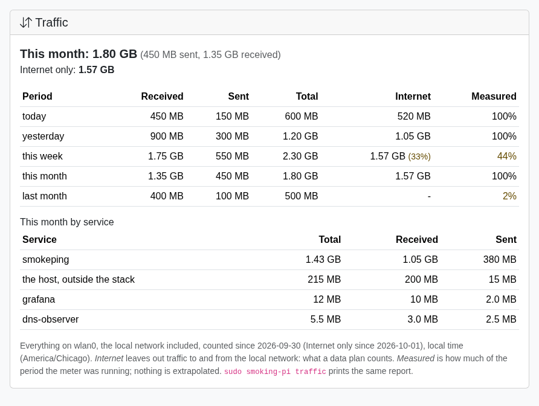
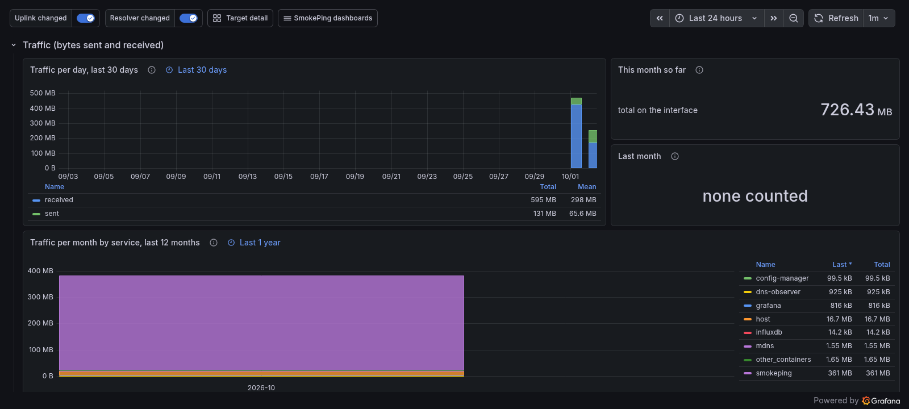

# Measurement budget

Every target you add costs something: packets on your uplink, load on the
server at the other end, CPU on the Pi. One target is nothing. The DNS
wizard adopting 60 services over ICMP, TCP and three HTTP versions is not
nothing. The measurement budget makes that cost visible before it is a
surprise on a metered connection.

This first version is **accounting, not admission**. It reports what the
configured measurements cost against two ceilings. It does not throttle,
defer or drop anything; that comes later, once the numbers have earned
trust (see [What comes next](#what-comes-next)).

## The command

```bash
sudo smoking-pi budget
```

Standard and Pro (it reads config-manager's generated SmokePing config;
Basic has no config-manager). On the shipped seed:

```
probe          class    targets  step pings  samples/h    MB/day
CurlHTTP3      Curl           3   300     3        108      46.7
CurlHTTP1      Curl           3   300     3        108      32.4
CurlHTTP2      Curl           3   300     3        108      32.4
FPing          FPing          6   300    10        720       2.9
DNS            DNS            3   300     5        180       1.3
TCPPing        TCPPing        3   300     5        180       0.9

21 targets: 1404 samples/h of 20000 (7.0%), ~117 MB/day of 1000 (11.7%).
Approximate: SmokePing measurements only, from the generated config.
```

Most expensive first: what to cut is at the top. `--json` prints the
same report as JSON, which is also what the API returns:
`GET /budget` on config-manager (token-protected like the rest of it).

## On the dashboard

The web admin's dashboard (Standard and Pro) shows the same report as the
*Measurement budget* card: how much of each ceiling is used, the headroom
left, and every probe, most expensive first. The bar turns yellow at 75%
of a ceiling and red over it, and an over-budget card says what brings it
back. The *Bandwidth Usage* card at the top shows the daily total and its
average rate, and the Probes page shows each probe's MB/day, both from
this report.


Both figures are the configured cost of what SmokePing runs, not metered
traffic. When config-manager cannot be asked, the card says so instead of
guessing.

## In Grafana

On Pro with InfluxDB, the Overview dashboard (Grafana's home page) has a
*Measurement budget* row. It shows MB/day and samples per hour per probe,
stacked, with the ceiling as a dashed line, plus how much of each ceiling
is used now. A step in the stack is a change in targets or cadence, such
as a DNS wizard adoption, a new target or a shorter step. That is how you
see when the cost moved and why.


The series comes from `measurement_budget.py` in the SmokePing container.
Every five minutes it reads config-manager's `/budget` (the same report as
the command and the card) and writes `measurement_budget` (the totals and
the ceilings) and `measurement_budget_probe` (one point per probe, tagged
`probe` and `probe_class`). A probe with no measured cost has no
`mb_per_day` field rather than a zero. ClickHouse installs have no
Overview dashboard and get the web admin card only.

## What it counts

What SmokePing runs, read from the same files SmokePing loads: the
generated `Targets` and `Probes`, the CPE targets `cpe_discovery.py`
writes, and the `Database` defaults. A probe's samples per hour are
`targets × pings × 3600 / step`. Disabled targets and IPv6 targets gated
out by [IPv6 gating](ipv6-gating.md) are not in the generated file, so
they cost nothing and are not counted.

The bytes are per sample, both directions, IP headers included, and were
measured rather than derived:

| class | bytes per sample | what one sample is on the wire |
| --- | --- | --- |
| `FPing` | 168 | an echo request and its reply (fping's default 56 data bytes) |
| `FPing6` | 208 | the same over IPv6 |
| `DNS` | 300 | one lookup: ~80 bytes up, 80–165 down with dig's EDNS cookie |
| `TCPPing` | 200 | SYN, SYN/ACK, and the kernel's RST |
| `Curl`, HTTP/1.1 and HTTP/2 | 12,500 | one HEAD over TLS 1.3: the certificate chain, the response headers and curl's lookup of the name (9–17 KB across 23 sites, 12.5 KB on average) |
| `Curl`, HTTP/3 | 18,000 | the same HEAD over QUIC (15–22 KB, 17–18 KB on average): every client Initial is padded to 1200 bytes, and QUIC sends its own acknowledgments |

A probe of a class with no measured cost (a probe you added yourself) is
counted in samples and listed as unpriced, so the MB/day figure is not
read as complete.

Nearly all of the seed's bandwidth is TLS handshakes: an HTTP sample costs
70 to 110 times an ICMP one. That is why the HTTP probes send `HEAD`. Before
they did, each sample downloaded the whole home page, and the same seed
cost about 6 GB a day ([HTTP probes](http-probes.md#what-the-curl-sample-measures)).

## The ceilings

| setting | default | |
| --- | --- | --- |
| `MEASUREMENT_BUDGET_MB_PER_DAY` | 1000 | about 30 GB a month |
| `MEASUREMENT_BUDGET_SAMPLES_PER_HOUR` | 20000 | |

Both are in `.env.template`; set them with
`sudo smoking-pi config set MEASUREMENT_BUDGET_MB_PER_DAY 500`. An empty,
malformed or non-positive value falls back to the default: a typo does not
switch the check off. Over either ceiling, the report says so and what
brings it back: fewer targets, fewer pings, or a longer step
([Measurement frequency](measurement-frequency.md)).

The defaults are deliberately generous: the seed uses 12% of the bandwidth
and 7% of the samples. A DNS wizard adoption of 60 services over HTTP/1.1,
2 and 3 alone is about 2.2 GB a day, and shows as over budget.

## Measured traffic

Everything above is an **estimate**: the configured probes times a cost per
sample measured once. Pro also runs a **meter**. Every five minutes the
`uplink_traffic` exporter reads the kernel's byte counters
(`/proc/net/dev`) for the interface the default route leaves through, the
same uplink the Wi-Fi panels use, and keeps the last 24 hours.

- `smoking-pi budget` adds a line:
  `Measured on wlan0: ~1450 MB/day (1200 MB in, 250 MB out over the last 24.0 h), ...`
- The dashboard's budget card shows it as a bar against the same ceiling,
  and the top *Bandwidth Usage* card adds it under the estimate.
- Grafana's Overview draws it as the solid line on *Traffic against the
  budget (MB/day)*, over the stacked estimate and under the dashed
  ceiling. The series is `uplink_traffic` (tag `interface`; fields
  `rx_bytes`, `tx_bytes`, `seconds`, `mb_per_day`).


*A test Pi with the DNS wizard's HTTP targets: the estimate says 410
MB/day, and the meter, here only a minute old, says about twice that.
Ten minutes after an upgrade it read ~524 MB/day: a short window catches the
probes' bursts, which is why under an hour of data is gray.*

The meter counts **everything on that interface**, not only the
measurements. That is its point: the gap between the two lines is what
the Pi spends on other things. It includes:

- the microcut detector's pings to the CPE: 50 every 30 seconds to its
  IPv4 address, about 24 MB a day, and as many again to its IPv6 one when
  it has one (the netmeter counts them under `smokeping`, whose container
  runs the detector);
- LAN traffic on the same link: you opening Grafana or the web admin, and
  the DNS observer answering the house when the router forwards DNS to it;
- the stack's own downloads: image pulls on an upgrade, `apt`;
- anything else on the host: an assistant, the Cloudflare tunnels, a
  VPN's encapsulated traffic.

`mb_per_day` scales the hours covered to a day, so a meter that started an
hour ago already reads as a daily figure; the card and the command say how
many hours it rests on. Under an hour it is shown but not judged: no
percentage of the ceiling and a gray bar, since one image pull in the
first five minutes would read as hundreds of times the budget. When the
uplink changed interface during the day, both are named.

When a VPN owns the default route (a Tailscale exit node, WireGuard),
the interface metered is the tunnel: the figure is the traffic inside it,
not what leaves the radio. An interval is dropped, not guessed, when a
counter went backwards (a reboot), the uplink changed interface, or the
exporter was stopped for more than 15 minutes. A meter that stopped writing
for 15 minutes is shown as stale. Basic and Standard have no meter.
Which service sends what is the next section.

## By service

The meter above says how much; Pro also says **who**. The `netmeter`
container counts the same uplink per service, exactly, with nftables
counters keyed on each container:

- **Host-network services** (SmokePing and its exporters, the DNS
  observer, the alerter, the MCP server, mdns) by the cgroup of the socket
  that sends or receives. A connection's first packet also stamps it (one
  byte of the conntrack mark, bits 24-30, clear of Tailscale's), so the
  replies, ICMP echo replies included, count for the same service.
- **Bridged containers** (Grafana, the web admin, ai-insights, InfluxDB,
  PostgreSQL, config-manager) by their address, where their traffic is
  forwarded to the uplink.
- **host**: everything else on the uplink that no container sent or
  received (apt, an assistant, sshd, Docker pulling an image).
- **other_containers**: forwarded traffic of containers this stack does
  not name, such as a tunnel started by hand with `docker run`.

`smoking-pi budget` lists them after the measured line, most traffic
first. The dashboard's budget card has a *Measured by service* table,
and Grafana's Overview has *Measured traffic by service (MB/day)*,
stacked. The series is `service_traffic` (tags `service` and `kind`:
`host_network`, `bridge` or `rest`; fields `rx_bytes`, `tx_bytes`,
`seconds`, `mb_per_day`).

On a test Pi, ten minutes after an upgrade, `smoking-pi budget` read
(the uplink meter said ~524 MB/day over the same time):

```text
By service, over the last 10 min (not yet a daily figure):
  smokeping          ~   463.7 MB/day  (2.3 MB in, 1.0 MB out)
  host               ~    37.4 MB/day  (0.1 MB in, 0.1 MB out)
  other_containers   ~     2.4 MB/day  (0.0 MB in, 0.0 MB out)
  grafana            ~     1.1 MB/day  (0.0 MB in, 0.0 MB out)
  mdns               ~     1.1 MB/day  (0.0 MB in, 0.0 MB out)
  dns-observer       ~     0.7 MB/day  (0.0 MB in, 0.0 MB out)
```

The services add up to ~506 MB/day against the interface's ~524. The two
were read over slightly different windows (the uplink meter's was a
minute longer), and the interface also counts link-layer overhead that the
per-container counters do not, so a few percent of difference is
expected.

**Checked against the estimate.** Over 14.6 steady hours on the same
Pi (40 HTTP probes from the DNS wizard and the seed, a third of them
HTTP/3), the meter put `smokeping` at ~528 MB/day and the whole uplink at
~559. The estimate, with HTTP/3 priced like HTTP/2, said 410: 29% short.
Measuring each probe's HEAD on its own (the same curl command in a
throwaway container, reading that container's byte counters) found the
gap: HTTP/1.1 and HTTP/2 cost what the table said, HTTP/3 about 45% more.
Priced per version, the probes come to ~506 MB/day; with the microcut
detector's ~24 that is ~530, within 1% of what the meter counted.

**What it changes on the host.** It adds one table, `inet
smoking_pi_meter`, with three chains (output, input, forward) at
priority -150. They hold counters and a conntrack mark and nothing else:
no rule drops, accepts, rejects or rewrites a packet, so whatever the
host's firewall (Docker's, Tailscale's, yours) decided before, it still
decides. Stopping the container removes the table. `NETMETER=off` in the
env file loads nothing. To look at it: `sudo nft list table inet
smoking_pi_meter`.

The container runs with `CAP_NET_ADMIN` and no other capability, on the
host network and in the host's cgroup namespace (nft resolves a cgroup
by its path), on a read-only filesystem. It asks config-manager which
container is which (`GET /meter/containers`) rather than holding the
Docker socket. A container that restarts gets a new cgroup, even with
the same container id (`docker restart`), and nft keys a rule on the
cgroup itself, not its path; the meter watches each cgroup's identity
and reloads the table within a minute, keeping what the counters held.
Each host-network service keeps its own mark number across reloads, so a
long-lived connection is never credited to another service.

Limits worth knowing:

- **The uplink is a physical interface** (one with a device: `wlan0`,
  `eth0`) unless `NETMETER_INTERFACES` names it. An uplink that is a
  bridge, a bond, a VLAN or PPPoE needs that setting; without it the
  meter says so in its status and counts nothing.
- **A VPN's encrypted packets** leaving the uplink (tailscaled, WireGuard)
  are counted as `host`, not as the service whose traffic they carry.
- **Inbound multicast** (mDNS questions to the mdns service) is not tied
  to a socket on the way in and is counted as `host`; what mdns sends is
  counted as mdns.
- **The conntrack mark bits 24-30 stay** on the connections that carried
  them until those connections end, even after the table is removed. A
  firewall of your own that copies the whole conntrack mark into the
  packet mark without a mask (some multi-WAN or policy-routing setups)
  would see them; Docker and Tailscale do not do this. `NETMETER=off`
  if yours does.

## Traffic accounting

The meters above give a rate; Pro also keeps a **ledger**: what the Pi
sent and received per day, so you can ask how much it has spent in the
periods a data plan is billed in.

```bash
sudo smoking-pi traffic
```

```text
Traffic on wlan0 (local time, America/Chicago), measured since 2026-09-30, Internet only since 2026-10-01.

                received       sent      total  covered   Internet  covered
today             450 MB     150 MB     600 MB     100%     520 MB     100%
yesterday         900 MB     300 MB    1.20 GB     100%    1.05 GB     100%
this week        1.75 GB     550 MB    2.30 GB      44%    1.57 GB      33%
this month       1.35 GB     450 MB    1.80 GB     100%    1.57 GB     100%
last month        400 MB     100 MB     500 MB       2%          -        -
last 30 days     1.75 GB     550 MB    2.30 GB       7%    1.57 GB       5%

received/sent/total: everything on the interface, the local network included.
Internet: the same without traffic to and from the local network (what a data plan counts).
covered: how much of the period each meter was running; nothing is extrapolated.

This month by service:
  smokeping             1.43 GB  (1.05 GB in, 380 MB out)
  host                   215 MB  (200 MB in, 15 MB out)
  grafana                 12 MB  (10 MB in, 2.0 MB out)
  dns-observer           5.5 MB  (3.0 MB in, 2.5 MB out)
```

*An example: the uplink meter started on 30 September, half a day before
the month ended, and the netmeter a day later. Hence the low coverage for
last month, the week and the 30 days, and the Internet column's own.*

- **Two figures.** *total* is everything on the uplink interface, as the
  uplink meter counts it. *Internet* is the netmeter's count of the same
  interface without the traffic whose other end is on the local network:
  private addresses (`10/8`, `172.16/12`, `192.168/16`, `fc00::/7`),
  link-local (`169.254/16`, `fe80::/10`), multicast, broadcast and the
  unspecified addresses (`0/8`, `::`). That is what an ISP's data cap
  sees. The difference is the LAN: you opening
  Grafana or the web admin, the DNS observer answering the house, mDNS. A
  LAN numbered from public space (a global IPv6 prefix on the LAN) counts
  as Internet, and so does carrier-grade NAT space (`100.64/10`), which
  is the ISP's.
- **Local dates.** Days, weeks (Monday to Sunday) and months follow the
  stack's `TZ`. An interval that straddles midnight counts for the day it
  ends in, at most five minutes on the wrong side.
- **covered** says how much of the period each meter was running, the
  Internet column its own (the netmeter can start later, or be off). A
  reboot loses one five-minute interval (the kernel's counters start
  again from zero); a stopped container loses what it did not see. The
  figures are what was counted, never extrapolated: at 90% covered, the
  real figure is about a tenth higher. Days follow real time, so a
  daylight-saving day is 23 or 25 hours.
- **Internet against total.** The two come from different counters: the
  total is the interface's (`/proc/net/dev`, which also counts link-layer
  headers and ARP), the Internet figure the netmeter's (IP packets). So
  even traffic that is all Internet reads a few percent lower in the
  Internet column, and in a period where the netmeter covered more than
  the uplink meter, the Internet figure can exceed the total: compare
  them at equal coverage.
- **Kept** 400 days per day, so this month can be set beside the same
  month a year ago; services per month, for 25 months (per day they
  would more than double a file rewritten every five minutes on an SD
  card). A day dated before 2020 (a Pi without a real-time clock, before
  it synced) or after tomorrow is not counted. Each meter keeps the
  previous copy of its file (`.bak`) and, if it finds its file damaged,
  sets it aside as `.corrupt` and goes on from the copy. The ledger lives
  in the meters' state files (`uplink_traffic.json` in SmokePing's
  `smokeping-config` volume, `state.json` in `netmeter-state`), so it
  works with ClickHouse as well as InfluxDB and survives losing the time
  series. `smoking-pi backup` copies both volumes.
- `--json` prints the report; the API is `GET /traffic` on config-manager.
  With InfluxDB, the netmeter also writes `internet_traffic` (fields
  `rx_bytes`, `tx_bytes`, `seconds`, `mb_per_day`) beside
  `service_traffic`.

The web admin's dashboard has the same figures in a **Traffic** card,
below the budget card, and the top *Bandwidth Usage* card adds this
month's total:



*Sample data. A period measured for less than 99% of its time shows its
coverage in amber, and the Internet column shows its own when the netmeter
covered less.*

Grafana's **Overview** has a *Traffic* row (InfluxDB): received and sent
per day over the last 30 days with the Internet-only part as a line, this
month so far and last month (the interface's total and the Internet
part), and each service's traffic per calendar month over the last 12.
They sum the same five-minute series (`uplink_traffic`,
`internet_traffic`, `service_traffic`), so they work back to when the
meters started, not only since the ledger; but they say nothing about
coverage: a gap is simply a shorter bar. Days and months there follow
the dashboard's time zone (your browser's by default), the card and the
command the Pi's `TZ`; near midnight the two can split a day differently.



*A test Pi two days after its meters started: hence one month, two days,
and nothing last month. The Internet line and figure are missing because
that Pi's netmeter predated them.*

Basic and Standard have no meters; `smoking-pi traffic` says so, and the
card says there are no figures yet. With ClickHouse, the command and the
card work (the ledger is in the state files) and the Grafana row does
not (the meters write their series to InfluxDB only).

## What it does not count yet

The estimate leaves out measurements outside SmokePing, which do not grow
with the target list (the meter above sees them):

- **The CPE microcut detector** (Pro, InfluxDB): 50 pings to the CPE
  (the ISP's first hop, which `cpe_discovery` finds) every 30 seconds, per
  address family, about 144,000 a day each, or ~24 MB/day over IPv4 and
  ~30 MB/day over IPv6. That hop is past the router, so the pings cross
  the uplink and the netmeter counts them under `smokeping`, as Internet
  traffic when the hop has a public address. It is the largest single
  source of packets on the box.
- **Resolver identity and the public address** (Pro, InfluxDB): a few
  DNS lookups every 15 minutes, well under 1 MB a day.
- **The DNS observer's canary**: one lookup through the router every five
  minutes, and a self-test against itself on the Pi.
- **On-demand checks**: the DNS wizard's pre-flight, `smoking-pi dns test`,
  the OCA refresh.

## What comes next

From the roadmap, in order:

1. Admission: when the requested set exceeds the budget, reduce cadence,
   samples or targets, with deterministic rotation so the whole set is
   eventually covered, and report requested vs admitted vs deferred.
2. Per-destination limits (service, prefix, ASN) so a large discovered
   target set does not turn into concentrated probing of one operator.
3. The DNS wizard and future traceroute measurements asking this budget
   instead of keeping limits of their own.
